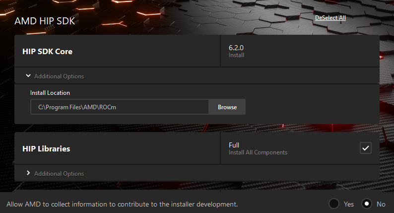
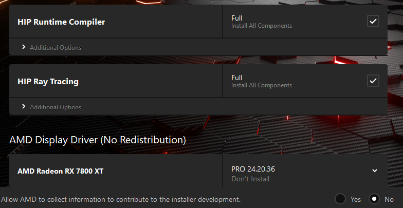
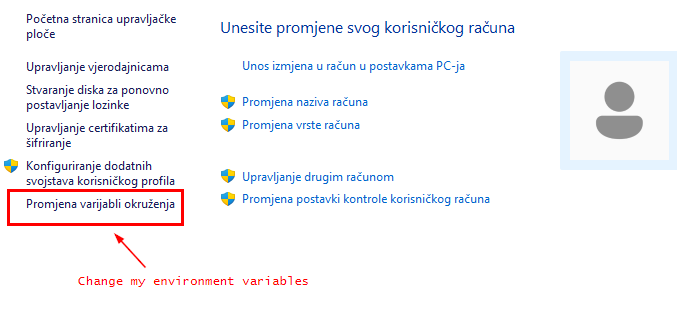
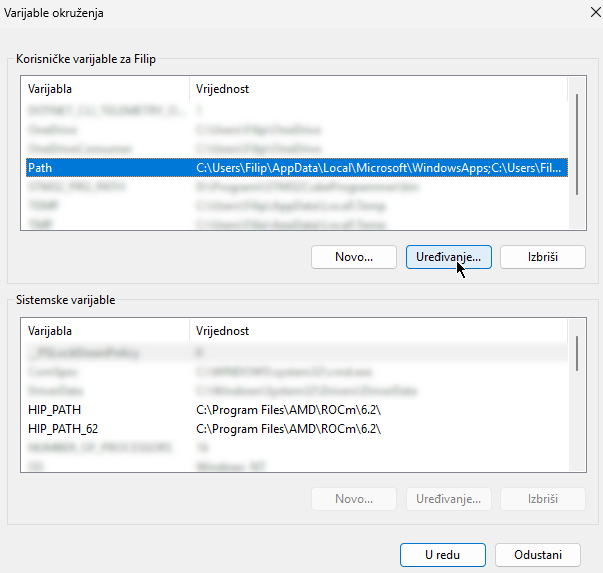
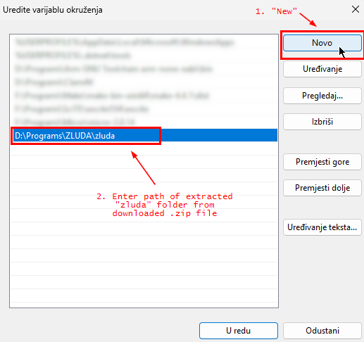
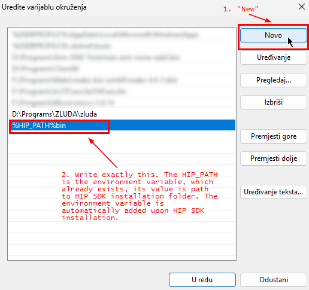

# Unofficial PyTorch ROCm hack for Windows

This small project aims to setup minimal requirements in order to run
PyTorch computatiuons on AMD Radeon GPUs on Windows 10 and Windows 11 PCs as
natively as possible.
It utilizes ZLUDA and AMD's HIP SDK to make PyTorch execute code for CUDA
device on AMD, with near native performance.
In contrast for ROCm on Linux some performance is lost on Windows, mostly
on ZLUDA library translating CUDA code to AMD's HIP kernel code.
This Python module code can be run directly on Windows, no WSL is needed.

## Motivation
This simple project is made from my annoyance of AMD's focus on Linux,
and not releasing fully-featured ROCm software stack to run natively on
Windows PCs.
I got sick of waiting AMD to finally release full ROCm stack, so I made
this Python module, along with this documentation, as a workaround to
provide somewhat good enough solution (at least for me), until full
ROCm is released and PyTorch releases official version for ROCm on
Windows.
As time of writing this (January, 13th, 2025.), AMD only partly released
ROCm software stack for Windows.
This only includes HIP SDK (current version 6.2.4) which is supported by
some AMD Radeon GPUs, while the MIOpen and MIGraphX AI libraries are not
available yet.
PyTorch relies on MIOpen and MIGraphX to use AMD GPU for tensor
computations.

## NOTICE
Even by going through all this documentation and setting up HIP, ZLUDA and
PyTorch to work together as described here, I cannot guarantee that this
will work on every setup.
I have only tested it on one setup, using AMD GPU (Radeon RX 7800 XT),
(currently) latest HIP SDK version (6.2), and ZLUDA v3.8.6 for Windows
amd64.
You will hate to hear it, and I hate to say it, but I can only confirm
that *it works on my machine*.
Adjustments to this module may be needed to make it work on Windows PCs
with different AMD GPUs.

## Drawbacks
Any change in the Python source code which handles tensors on GPU
(cuda device) results in ZLUDA recompiling CUDA code for ROCm, which can
take from 5 minutes up to 30 minutes, depending on how large the project is.
For smaller project, its better to just use PyTorch on CPU.
Reruning the same code however, is almost instant, once it is compiled.
This is because compiled CUDA code gets cached, and is reused if no
changes are made in the code.

## Hardware requirementrs
HIP-compatible AMD GPU is required.
The list of supported AMD GPUs can be viewed
[here](https://rocm.docs.amd.com/projects/install-on-windows/en/latest/reference/system-requirements.html).
The GPUs on which this library will most likely work are the ones which
have both "Runtime" and "HIP SDK" columns ticked.
For other GPUs, which are not fully suported by AMD's HIP SDK, additional
steps are required.
Please refer to the following
[link](https://github.com/vladmandic/automatic/wiki/ZLUDA),
in case the GPU is not fully supported by HIP SDK (see section
"Replace HIP SDK library files for unsupported GPU architectures").

## Software requirements
1. Windows 10 or Windows 11 (obviously)
2. Python, v3.10, can be downloaded from either
   [Microsoft Store](https://apps.microsoft.com/detail/9pjpw5ldxlz5) or
   [Python Website](https://www.python.org/downloads)
3. [AMD HIP SDK, v6.2](https://www.amd.com/en/developer/resources/rocm-hub/hip-sdk.html)
4. [ZLUDA for Windows, v3.8.6](https://github.com/lshqqytiger/ZLUDA/releases/tag/rel.d60bddbc870827566b3d2d417e00e1d2d8acc026)
5. [Git for Windows](https://git-scm.com/downloads/win)
   (optional, but recommended)
6. [Strawberry Perl](https://strawberryperl.com), any version

## Installation and setup

### Installing Python

There are many ways to install Python, I listed some of them, choose one.
If you prefer other ways of installing Python (such as Anaconda), you
can skip this Python installation section, just make sure you install
Python v3.10.
1. Microsoft Store
    - Open your Microsoft Store app
    - Search for Python 3.10
    - Just click on the buton near Python 3.10
    - The Python 3.10 will be downloaded and installed

2. Python website
    - Open the [Python website](https://www.python.org/downloads) in your
      favorite web browser
    - Search for Python 3.10 on the website, and click download link next
      to it
    - After downloading, open Python installer and instal it into the
      desired location
    - Make sure, upon installing the Python to add it into PATH variable,
      so Python can be accessible anywhere from Windows PowerShell

### Strawberry Perl installation

Just download [Strawberry Perl](https://strawberryperl.com) and install
it on desired location.
Any version will do.
The latest version is recommended.
It is used for running hipc compiler.

### AMD HIP SDK installation

1. Download HIP SDK 6.2 version from
   [here](https://www.amd.com/en/developer/resources/rocm-hub/hip-sdk.html).
2. After downloading, open the installer and choose the following options:
    - HIP SDK Core (you can choose the desired install location, under the
      "Additional Options" dropdown menu, default install location is
      recommended, C:\Program Files\AMD\ROCm)
    - HIP Libraries - tick "Full Install All Components"checkbox
    - HIP Runtime Compiler - tick "Full Install All Components"checkbox
    - HIP Raytracing - tick "Full Install All Components"checkbox
    - AMD Display Driver - if you already have AMD drivers installed, this
      field is not necessary, you can leave "Don't Install" option.
      This field installs the PRO version of AMD driver, but PRO version is
      not neccessary for HIP SDK to work, ordinary and up-to-date drivers do
      their job just fine.
    - Allow AMD to collect information to contribute to the installer
      development - choose either YES or NO, this one is up to you
3. Click on "Install" button





### ZLUDA setup

1. Open the [ZLUDA GitHub website](https://github.com/lshqqytiger/ZLUDA/releases/tag/rel.d60bddbc870827566b3d2d417e00e1d2d8acc026)
   in your favorite web browser
2. Download "ZLUDA-windows-rocm6-amd64.zip"
3. Extract "zluda" folder from .zip archive to desired location
   (e.g. D:\Programs\ZLUDA)
4. Open extracted "zluda" folder
5. Make a copy of cublas.dll file and rename it to cublas64_11.dll
6. Make a copy of cusparse.dll file and rename it to cusparse64_11.dll
7. Make a copy of nvrtc.dll file and rename it to nvrtc64_112_0.dll

Example of copying and renaming DLL files in Windows PowerShell:

```
> D:
> cd D:\Programs\ZLUDA\zluda
> copy-item cublas.dll cublas64_11.dll
> copy-item cusparse.dll cusparse64_11.dll
> copy-item nvrtc.dll nvrtc64_112_0.dll
```

### System environment setup

In order for ZLUDA and HIP SDK to be visible and accessible from the entire
system, the ZLUDA's folder and HIP's bin folder should be added into PATH
environment variable.
You can either add them into your local PATH environment variable, which is
only accessible from your local Windows account.
Otherwise, you can add them into your system variables, which will be
visible from the entire system, but you will need administrator permission
to access and modify system environment variables there.
I recommend to just modify local PATH environment variable, since it is
more safe, it won't affect other user accounts on the system and
administrator permission is not required.

1. Open Control Panel
2. Click on "User Accounts" icon, this opens you user account settings
3. Under your account settings, click on the
   "Change my environment variables" option, located on the left column
   (should be the last option in column).
   The environment variables window will pop out.
   
4. Select "Path" variable inside the upper window section, and click on
   "Edit..." button.
   The environment variable edit window will pop out.
   
5. Inside environment variable edit window, click on button "New" and enter
   the location of where the "zluda" folder is extracted
   (e.g. D:\Programs\ZLUDA\zluda).
   
6. Inside environment variable edit window, click on button "New" and enter
   the location HIP SDK bin folder.
    - This can be done by exactly entering the following: `%HIP_PATH%bin`
    - The other way is to manually type the location where the HIP SDK is
      installed (e.g. C:\Program Files\AMD\ROCm\6.2\bin)
   

### Python environment setup

Before running the program, installing Python packages is necessary.
In case you have installed plain Python v3.10 (either from Microsoft Store
or Python website), I recommend creating virtual environment and
installing all needed packages into active virtual environment (venv).
Creating Python venv is not necessary and these steps can be skipped.
Installing packages can be either done directly or using venv, by using pip,
but I highly recommend setting up venv.
In case of using some other Python distributions (such as Anaconda), you
can skip venv installation steps, and instead setup environment according
to your Python distribution.

#### Setting up Python virutal environment (venv)
1. Create the folder where you wish to setup venv files and install
   packages (e.g. D:\DEV\PythonVenvs\ZLUDAEnv).
2. Open Windows PowerShell or Command Prompt and go to newly created folder.
   E.g.:
   ```
   > D:
   > cd D:\DEV\PythonVenvs\ZLUDAEnv
   > python -m venv .
    ```
   That's it the Python venv is created in the desired folder.

3. After creating the venv, you need to activate it to tell Python to use
   your newly created venv.
   *NOTICE:* This step should be made everytime you open new PowerShell
   or Command Prompt window.

   Activating venv on Windows PowerShell:
   ```
   > D:\DEV\PythonVenvs\ZLUDAEnv\Scripts\activate.ps1
   (ZLUDAEnv) >
   ```

   Activating venv on Command Prompt:
   ```
   > D:\DEV\PythonVenvs\ZLUDAEnv\Scripts\activate.bat
   (ZLUDAEnv) >
   ```

That's it you are ready to install Python packages.

#### Installing Python packages using pip

Now it's time to install PyTorch.
Correct version of PyTorch (v2.3.1. with Cuda v11.8) should be installed.

If you have Git installed, you can clone my project into desired path
(e.g. D:\DEV\PythonProjects).
```
> D:
> cd D:\DEV\PythonProjects
> git clone https://github.com/Filip7700/unofficial-pytorch-rocm-hack-for-windows.git
> cd unofficial-pytorch-rocm-hack-for-windows
> pip -r requirements.txt
```

The other way to install packages is manually typing all the necessary
packages.
`> pip install torch==2.3.1 torchvision torchaudio --index-url https://download.pytorch.org/whl/cu118`

## Testing

If this project is not yet downloaded, download it using either `git clone`
command or manually downloading and extracting the .zip file from
web browser into desired location
(e.g. D:\DEV\PythonProjects\unofficial-pytorch-rocm-hack-for-windows).

Go to the project's folder:
`> cd D:\DEV\PythonProjects\unofficial-pytorch-rocm-hack-for-windows`

Run the mass_matrix_multiplication_test.py script.
This script demonstrates working of this project's library and the entire
setup, by multiplying matrices on AMD GPU device.
As said before, for the first run and for every in code change, the program
might take some time to compile CUDA code for ROCm, which can take from
5 minutes to 30 minutes.
User patience is advised for the first run.
Just let the program compiles, and when finished, you can open Task Manager
and see how is your GPU being utilized.
If you see result matrices getting printed out in Windows Powershell
or Command Prompt, and you see your GPU being 100% utilized, that is a sign
that everything is working successfully.
Congradulations, you are now ready to program all your favorite ML, AI
and LLM models!
Happy coding!
